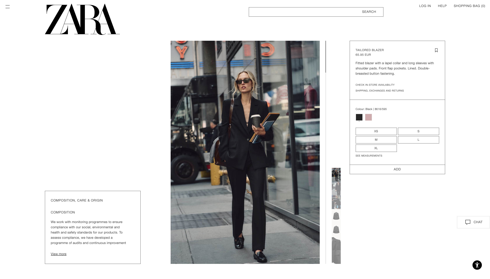
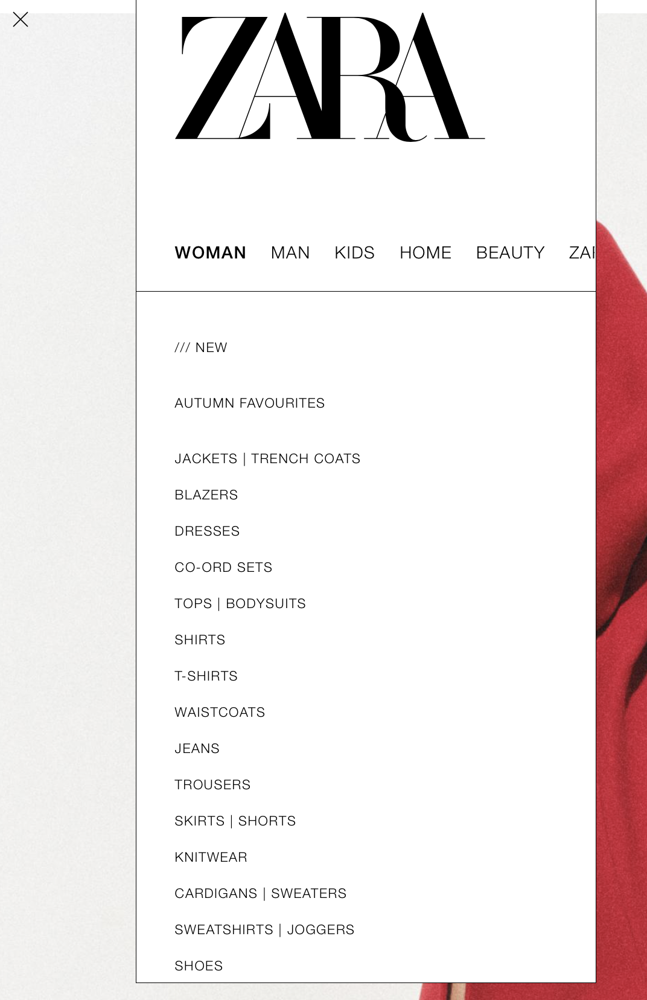
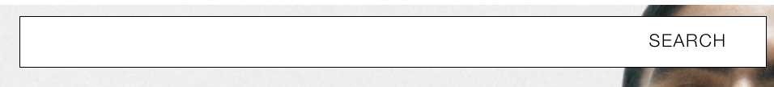

# Procesverslag
Markdown is een simpele manier om HTML te schrijven.  
Markdown cheat cheet: [Hulp bij het schrijven van Markdown](https://github.com/adam-p/markdown-here/wiki/Markdown-Cheatsheet).

Nb. De standaardstructuur en de spartaanse opmaak van de README.md zijn helemaal prima. Het gaat om de inhoud van je procesverslag. Besteedt de tijd voor pracht en praal aan je website.

Nb. Door *open* toe te voegen aan een *details* element kun je deze standaard open zetten. Fijn om dat steeds voor de relevante stuk(ken) te doen.

## Jij

  
uitwerken voor kick-off werkgroep

  ### Auteur:
  Cassidy Starke

  #### Je startniveau:
  Blauw

  #### Je focus:
  hier je focus (kies uit responsive óf surface plane)
 

## Je website

  
uitwerken voor kick-off werkgroep

  ### Je opdracht:
  (https://www.zara.com/nl/)

  #### Screenshot(s) van de eerste pagina (small screen): 
  Beginpagina  
  

  #### Screenshot(s) van de tweede pagina (small screen):
  detail pagina
  
 

Ik wil de webshop pagina's zo goed meogelijk namaken en/ of verbeteren. ik ben niet zo heel goed in coderen, ik begin rust (blauwe piste), wie weet wil je later nog iets meer uitdagens doen.

## Toegankelijkheidstest 1/2 (week 1)

  
uitwerken na test in 2e werkgroep

  ### Bevindingen
  Lijst met je bevindingen die in de test naar voren kwamen:
  - de site werkt niet heel handig met een screenreader, het stopt vaak uit het niets en leest onnodige informatie voor. Er werden namelijk dingen voorgelzen die ik niet op de site kon zien en dus heel er van door de war raakte.

  De content werd ook niet goed benoemd, je zou dneken dat ze de afbeelding van het kledingstuk of artiekl wel duidelijk zouden beschrijven maar dat was helaas niet zo.
  De screenreader gaat er gewoon overheen alsof het niet bestaat. De linkjes en de headings weder wel goed benoemt en ook gaat er een focus overheen om duidelijk aan te geven waar de gebruiker op dit moment is.  

  Verder was de sit eigenlijk wel good toegangkelijk en responsive, ze hebben namelijk ook zelf een assitant knop die geschikt is voor heel veel soorten beperkingen en aandoeningen. Ik moet eerlijk zeggen dat deze knop mij nooit eerder is opgevallen terwijl ik best vaak op de webiste van de Zara kom. moet je nagaan hoeveel je niet over dit soort dingen nadenkt wanneer het niet van toepassing is voor jou.   

## Breakdownschets (week 1)

  
uitwerken na afloop 3e werkgroep

  ### de hele pagina: 
  

  ### dynamisch deel (bijv menu): 
  

  ### wellicht nog een dynamisch deel (bijv filter): 
  

## Voortgang 1 (week 2)

  
uitwerken voor 1e voortgang

  ### Hoorcollege:

  We hebben een leerzame lezing gekregen van Darice de Cube, ze vertelde haar verhaar over haar beperkingen en hoe ze hier mee leeft. Zij is doof en vertelde ons hoe zij tewerk gaat met bepaalde "dagenlijkse" dingen zoals een omroep van de NS op het station of zelfs zo iets wat voor ons een heel eenvoudig telefoontje is. 

  De tweede hoorcollege werd gegeven door Bram, Hij is blind en deelde een beetje over zijn leven. Hij begon met vertellen over hoe het internet gebruik gaat voor hem  met een screenreader. Het is heel erg noodzakelijk voor hem en vele nadere blinden of slechtziewnde dat een website gelzen kan worden door een screen reader. De stem is niet alijd even handig maar met oefening kan je er heel veel mee. 

  ### Stand van zaken
  IK heb wat moeite met opstarten, ik ben niet zo goed hierin en ik weet niet waar ik moet beginnen. ik heb wat foto's van de Zara website gekozen die ik op de voorpagina wil hebben. de indeling wil ik hetzelfde hoduen, ik vind het namelijk heel mooi hoe je direct de kelding ziet. Zara is heel minimalistisch en dat wil ik ook zo houden. 

  Ook ben ik begonnen met het maken van de navigatiebalk, Zara heeft er twee en ik weet nog niet zo goed hoe ik dit kan doen. Ik wil hiervoor graag de studentassistent op hulp vragen. 

  

  ### Agenda voor meeting
  samen met je groepje opstellen

  | student 1      | student 2          | student 3    | student 4        |
  | ---            | ---                | ---          | ---              |
  | dit bespreken  | en dit             | en ik dit    | en dan ik dat    |
  | en dat ook nog | dit als er tijd is | nog een punt | dit wil ik zeker |
  | ...            | ...                | ...          | ...              |

  ### Verslag van meeting
  hier na afloop snel de uitkomsten van de meeting vastleggen

  - De studentassistent heeft mij geholpen met de naviagtiebalk, het was een boel maar om 2 te kunnen hebben in de header en deze ook met css aan te kunnen passen heeft hij voorgesteld een div eromheen te maken. 
  - Ik heb geleerd hoe je videos via Chrome inspector kan downloaden, super handing want dit wil ik misschien ook voor mijn ontwerp gebruiken. 
 

Ik ben verder gaan werken aan mijn website, Ik was vergeten dat het responsive moet zijn en dat we het niet alleen voor de mobiele formaat kamen. Heel jammer want ik moet nu best veel weer aanpassen. 

## Voortgang 2 (week 3)

  
uitwerken voor 2e voortgang

  ### Stand van zaken
 Ik ben weer verder gaan werken, het is nogsteeds even lastig voor mij maar we komen er langzamerhand wel. Ik ben bezig geweest met het responsive maken, ik denk dat het is gelukt alles schaalt goed mee als ik de website groter of kleiner maak. Ik heb  een les gemist omdat ik ziek was en nu snap ik het helemaal niet meer eigenlijk. de opdrachten thuis alleen maken hebben mij niet zoveel geholpen. Ik ga in de les wat meer hulp/ uitleg vragen. 

  ### Agenda voor meeting
  samen met je groepje opstellen

  | student 1      | student 2          | student 3    | student 4        |
  | ---            | ---                | ---          | ---              |
  | dit bespreken  | en dit             | en ik dit    | en dan ik dat    |
  | en dat ook nog | dit als er tijd is | nog een punt | dit wil ik zeker |
  | ...            | ...                | ...          | ...              |

  ### Verslag van meeting
  De studentassistent heeft mij met wat dingen geholpen, ik kon even mijn hart luchten over hoe lastig ik sommige onderdelen vind en hoe verwarrend het omdat ik ziek was. hij heeft mij wat tips gegven en wat van de lesstof rustig uitgelegd. We zijn samen gaan kijken hoe ik heb beste een menu knop kon maken want ik snapte het niet. helaas hadden we niet heel veel tijd dus ga ik dit thuis verder afmaken. 

  - gesproken over kennis en wat ik moeilijk vond 
  - hulp gekregen met een onderdeel uit mijn code
  - extra stof gekregen voor hulp
- ...

Ik had het voortgangsgesprek gemist omdat ik mij perongeluk had verslapen, dit hebben ik en de studentassistent op een later moment ingehaald. 

## Toegankelijkheidstest 2/2 (week 4)

  
uitwerken na test in 9e werkgroep

  ### Bevindingen
  - Ik was nog niet helemaal klaar met mijn website en het was duidelijk dat ik nog wat belangrijke dingen miste. Wel kan ik trots zeggen dat de screenreader goed de koppen en links kan lezen

  ik miste wel de focus op de links dus daar moet ik nog aan werken. verder las het netjes elke beschrijving voor de afbeeldingen voor en scrollde het zelf langs de pagina. Ik heb natuurlijk zelf geen onnodige dingen erin geplaatst dus dat leest het niet voor. Ik heb wel dat de websites content allemaal in het engels is en de screenreader is het Nederlnds voorleest en het best vervelend klinkt soms. 

  Mijn site is verder wel goed responsive en ziet er voor mij good uit op elk formaat, geeft het duidelijk contrast aan omdat Zara natuurlijk heel minimalistisch is. Bijna alles is zwart op wit wat altijd het beste contrast is.  

## Voortgang 3 (week 4)

  
uitwerken voor 3e voortgang

  ### Stand van zaken
  hier dit ging goed & dit was lastig (neem ook screenshots op van delen van je website en code)

  ### Agenda voor meeting
  samen met je groepje opstellen

  | student 1      | student 2          | student 3    | student 4        |
  | ---            | ---                | ---          | ---              |
  | dit bespreken  | en dit             | en ik dit    | en dan ik dat    |
  | en dat ook nog | dit als er tijd is | nog een punt | dit wil ik zeker |
  | ...            | ...                | ...          | ...              |

  ### Verslag van meeting
 Ik heb eindelijkd de menuknop aan de praat gekregen, het was een hoop priegelwerk en frustraties omdat hetme niet wilde lukken. Ik was ook eigenlijk op een punt waar ik bijna geen hulp durfte vragen omdat het al zover in het blok is en ik er nogsteeds moeite mee had. gelukkig is het wel gelukt, hiet is nog niet op en top mooi maar daar kan ik nog wat aan doen. 

  Ik heb bijde de tweede pagina af, ik heb een artikel gevonden wat ik verder wilde uitwerken in de detail pagina. Er waren bets veel onderdelen die Zara op hun webiste heeft die ik zelf niet kon maken, dus heb ik het zo mooi mogelijk op een andere maniet gedaan. De foto gallary was mij iets te lastig dus die heb ik er niet ingedaan. Ook hebben ze onder in de pagina nog "extra" producten die men misschien nog zou willen, de layout is wat lstig maar ik ga het proberen.  

  Ik was nog aan het strugglen met de repostitory op github te plaatsen, ik had helemaal niet door dat het in dit bestand moest dus had ik een eige VSC bestand aangemaakt. het was een gedoe om het uiteindelijk dus op github te krijgen maar gelukkig was het gelukt met de hulp van de docent. 

  
  

## Eindgesprek (week 5)

  
uitwerken voor eindgesprek

  ### Je uitkomst - karakteristiek screenshots:
  

  ### Dit ging goed/Heb ik geleerd: 
  Korte omschrijving met plaatjes

  

  ### Dit was lastig/Is niet gelukt:
  Korte omschrijving met plaatjes

  

## Bronnenlijst

  
continu bijhouden terwijl je werkt

  Nb. Wees specifiek ('css-tricks' als bron is bijv. niet specifiek genoeg). 
  Nb. ChatGpT en andere AI horen er ook bij.
  Nb. Vermeld de bronnen ook in je code.

  1. De opdrcahten uit de les zijn de einige bronnen samen met de studentassistenten.
  2. bron 2
  3. ...

